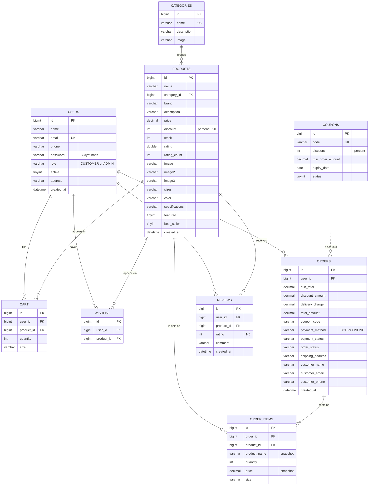

# 9. ER Diagram

The database holds nine entities. `USERS` and `PRODUCTS` are the two hubs;
everything else records a relationship between them or a transaction derived
from one.

## Cardinality, stated in words

| Relationship | Reading |
|---|---|
| USERS → CART | One user has zero or many cart lines; each line belongs to exactly one user |
| USERS → WISHLIST | One user saves zero or many products; each saved row belongs to one user |
| USERS → ORDERS | One user places zero or many orders; each order belongs to exactly one user |
| USERS → REVIEWS | One user writes zero or many reviews, but at most one per product |
| CATEGORIES → PRODUCTS | One category groups zero or many products; each product sits in exactly one category |
| PRODUCTS → CART / WISHLIST / REVIEWS | One product may appear in many carts, wishlists and reviews |
| ORDERS → ORDER_ITEMS | One order contains **one or many** items — an order with no items is not permitted |
| PRODUCTS → ORDER_ITEMS | One product may be sold in many order items |
| COUPONS → ORDERS | A coupon may be used on zero or many orders; an order may have no coupon. Recorded as a code string, not a foreign key, so deleting a coupon cannot corrupt order history |

## Design decisions worth defending in a viva

1. **`COUPONS` is deliberately not a foreign key on `ORDERS`.** The coupon code
   is copied onto the order as text. If the administrator later deletes
   `SPORTX10`, every past order still shows which code was applied and how much
   it saved. A foreign key would have forced either a cascade (destroying
   history) or a restriction (making coupons undeletable).

2. **`ORDER_ITEMS` duplicates `product_name` and `price`.** This is intentional
   denormalisation. An order is a legal record of what was sold at what price;
   if the administrator renames a product or changes its price next month, the
   old invoice must not change with it.

3. **`CART` carries `size`, `WISHLIST` does not.** A cart line is a specific
   purchasable thing — a size-M jersey. A wishlist entry is an expression of
   interest in the product, before the size decision is made.

4. **`rating` and `rating_count` are stored on `PRODUCTS`.** They could be
   derived with `AVG()` over `REVIEWS` on every read. They are cached instead,
   and recalculated whenever a review is inserted, because the catalogue page
   displays the rating for every product on every page load and the aggregate
   would otherwise be computed dozens of times per request.

5. **`UNIQUE (user_id, product_id)`** is enforced on `WISHLIST` and on
   `REVIEWS`. On `CART` the uniqueness is `(user_id, product_id, size)`, so the
   same shirt in two sizes is two lines.
