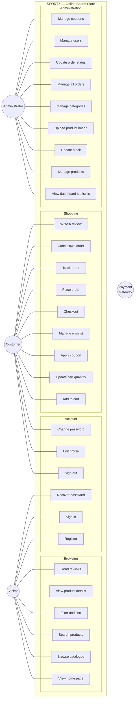

# 10. Use Case Diagram

## Actors

| Actor | Description |
|---|---|
| **Visitor** | An unauthenticated user. Can browse and search, but cannot transact. |
| **Customer** | An authenticated user with the `CUSTOMER` role. Inherits everything a Visitor can do. |
| **Administrator** | An authenticated user with the `ADMIN` role. Manages the store. |
| **Payment Gateway** | External system. Simulated in this project. |

> A Customer inherits every Visitor use case; an Administrator is also an
> authenticated user and so inherits the Account use cases. The arrows above
> show only the *additional* capability each role gains, to keep the diagram
> readable.

## Use case specifications

### UC-18: Place Order

| Field | Detail |
|---|---|
| **Actor** | Customer |
| **Goal** | Convert the cart into a confirmed order |
| **Preconditions** | The customer is authenticated; the cart holds at least one item; every item is in stock |
| **Postconditions** | An order exists with status `PENDING`; product stock is reduced; the cart is empty |
| **Trigger** | The customer presses *Place order* on the checkout page |

**Main flow**

1. The customer opens `/checkout`.
2. The system fetches the cart summary and displays the order total.
3. The customer fills in name, email, phone, address, city, state, country and PIN.
4. The customer selects Cash on Delivery or Online Payment.
5. The customer presses *Place order*.
6. The system validates every field.
7. The system opens a transaction.
8. For each cart line, the system re-checks that `quantity ≤ product.stock`.
9. The system recomputes the subtotal, the product discount, the coupon discount and the delivery charge **from the database**, ignoring any totals sent by the browser.
10. The system creates the order and its items, snapshotting each product's name and unit price.
11. The system decrements the stock of each product.
12. The system empties the cart.
13. The system commits the transaction.
14. The system redirects the customer to the order confirmation page.

**Alternative flows**

- **6a — A field is invalid.** The system highlights the field, shows what is wrong, and stops. Nothing is written.
- **8a — An item is no longer in stock.** The system aborts the entire transaction, rolls back, and reports which product is short and how many remain. The cart is untouched, so the customer can reduce the quantity and retry.
- **4a — Online payment is chosen.** The system marks `payment_status = PAID` immediately. *This is a simulation; no money moves.*
- **7a — The database fails mid-transaction.** The transaction rolls back completely. No partial order, no lost stock, no emptied cart.

### UC-28: Update Order Status

| Field | Detail |
|---|---|
| **Actor** | Administrator |
| **Goal** | Move an order along the fulfilment pipeline |
| **Preconditions** | The actor holds the `ADMIN` role; the order exists |
| **Postconditions** | The order's status is changed; if changed to `CANCELLED`, stock is returned |

**Main flow**

1. The administrator opens the Orders tab of the admin panel.
2. The system lists every order with a status dropdown on each row.
3. The administrator selects a new status.
4. The system calls `PUT /api/orders/{id}/status`.
5. The server verifies the `ADMIN` role, updates the status, and returns the order.
6. If the new status is `CANCELLED`, the server restores each item's quantity to product stock.
7. The list refreshes and a confirmation toast appears.

**Alternative flow**

- **5a — The caller is not an administrator.** The server returns `403 Forbidden`. The interface shows "You do not have permission to do that." This holds even if the request is sent directly with `curl`, because the check is a server-side matcher, not a hidden button.
