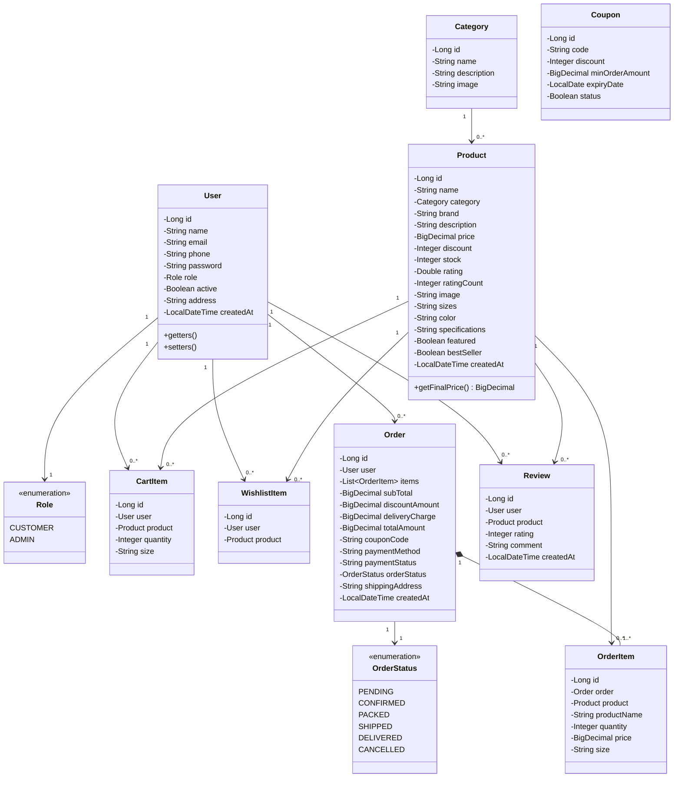

# 11. Class Diagram

## 11.1 Domain model (JPA entities)

> `Order *-- OrderItem` is composition, not association: an order item has no
> meaning outside its order and is deleted with it. Everything else is
> association — a product outlives any particular cart.

## 11.2 Layered architecture

```mermaid
classDiagram
    direction TB

    class AuthController {
        +register(RegisterRequest) AuthResponse
        +login(LoginRequest) AuthResponse
        +logout() ApiMessage
        +me() User
        +changePassword(Map) ApiMessage
    }
    class ProductController {
        +list(filters, sort, page, size) Page~Product~
        +byId(Long) Product
        +create(ProductRequest) Product
        +update(Long, ProductRequest) Product
        +updateStock(Long, Map) Product
        +delete(Long) ApiMessage
    }
    class CartController {
        +cart() List~CartItem~
        +summary(String coupon) CartSummary
        +add(CartItemRequest) CartItem
        +update(Long, Map) CartItem
        +remove(Long) ApiMessage
    }
    class OrderController {
        +place(OrderRequest) Order
        +list() List~Order~
        +byId(Long) Order
        +updateStatus(Long, Map) Order
        +cancel(Long) Order
    }
    class AdminController {
        +stats() DashboardStats
        +users() List~User~
        +setActive(Long, Map) User
        +coupons() List~Coupon~
    }

    class AuthService {
        -UserRepository users
        -PasswordEncoder encoder
        -JwtUtil jwt
        +register(RegisterRequest) AuthResponse
        +login(LoginRequest) AuthResponse
    }
    class ProductService {
        -ProductRepository products
        -CategoryRepository categories
        +search(...) Page~Product~
        +create(ProductRequest) Product
        +updateStock(Long, int) Product
    }
    class CartService {
        -CartItemRepository cart
        -ProductRepository products
        -CouponService coupons
        +summary(String, String) CartSummary
        +add(String, CartItemRequest) CartItem
        -assertStock(Product, int) void
    }
    class OrderService {
        -OrderRepository orders
        -CartService cart
        +placeOrder(String, OrderRequest) Order
        +updateStatus(Long, String) Order
        +cancelOwnOrder(Long, String) Order
    }

    class UserRepository {
        <<interface>>
        +findByEmail(String) Optional~User~
        +existsByEmail(String) boolean
    }
    class ProductRepository {
        <<interface>>
        +search(...) Page~Product~
        +findByFeaturedTrue() List~Product~
        +countByStockLessThan(int) long
    }
    class OrderRepository {
        <<interface>>
        +findByUserIdOrderByCreatedAtDesc(Long) List~Order~
        +totalRevenue() BigDecimal
    }

    class JwtUtil {
        -SecretKey key
        -long expirationMs
        +generateToken(String, String) String
        +extractEmail(String) String
        +isValid(String) boolean
    }
    class JwtAuthenticationFilter {
        +doFilterInternal(req, res, chain) void
    }
    class SecurityConfig {
        +filterChain(HttpSecurity) SecurityFilterChain
        +passwordEncoder() PasswordEncoder
    }
    class GlobalExceptionHandler {
        +handleNotFound(...) ResponseEntity
        +handleBadRequest(...) ResponseEntity
        +handleValidation(...) ResponseEntity
    }

    AuthController --> AuthService
    ProductController --> ProductService
    CartController --> CartService
    OrderController --> OrderService
    AdminController --> ProductService

    AuthService --> UserRepository
    AuthService --> JwtUtil
    ProductService --> ProductRepository
    CartService --> ProductRepository
    OrderService --> OrderRepository
    OrderService --> CartService

    JwtAuthenticationFilter --> JwtUtil
    SecurityConfig --> JwtAuthenticationFilter
```

## 11.3 Why the layers are separated this way

| Layer | Single responsibility | What it is forbidden to do |
|---|---|---|
| **Controller** | Translate HTTP into a method call and back | Contain business rules, or touch a repository directly |
| **Service** | Hold business rules and transaction boundaries | Know anything about HTTP — no `HttpServletRequest`, no status codes |
| **Repository** | Fetch and persist entities | Contain rules; it is an interface with no implementation written by hand |
| **Entity** | Model a database row | Carry validation annotations meant for user input |
| **DTO** | Carry data across the HTTP boundary, with validation | Contain logic |

The practical benefit: the stock rule in `CartService.assertStock` is enforced
whether the call arrives from the cart page, the product page, the wishlist
"move to cart" button, or checkout, because all four paths go through the same
service method. Had the rule been written in the controller, it would have to
be repeated four times — and one of them would eventually be forgotten.
