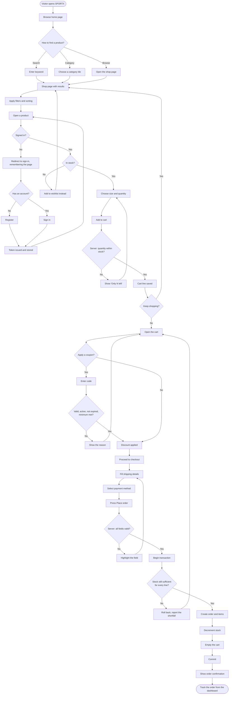
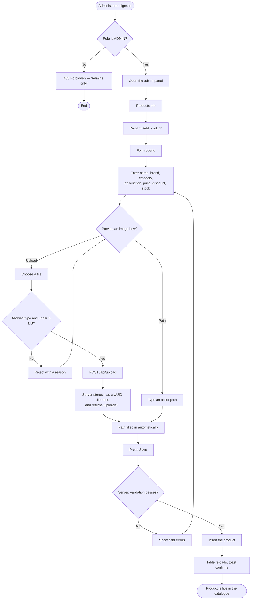
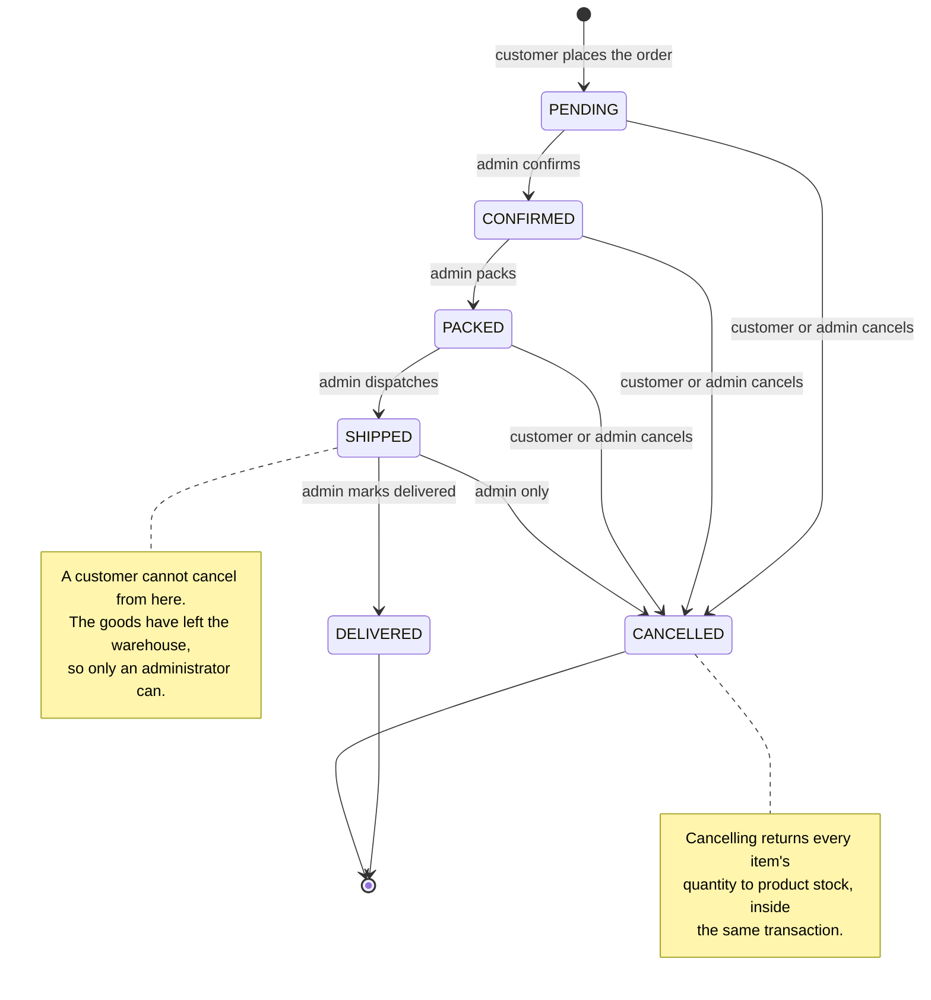
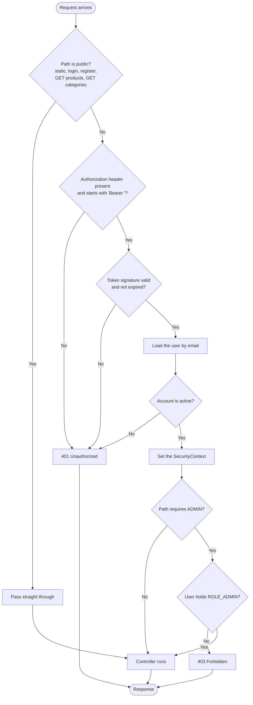

# 12. Activity Diagrams

## 12.1 Customer purchase journey

```mermaid
flowchart TD
    A([Visitor opens SPORTX]) --> B[Browse home page]
    B --> C{How to find a product?}
    C -->|Search| D[Enter keyword]
    C -->|Category| E[Choose a category tile]
    C -->|Browse| F[Open the shop page]
    D --> G[Shop page with results]
    E --> G
    F --> G
    G --> H[Apply filters and sorting]
    H --> I[Open a product]
    I --> J{Signed in?}
    J -->|No| K[Redirect to sign-in, remembering the page]
    K --> L{Has an account?}
    L -->|No| M[Register]
    L -->|Yes| N[Sign in]
    M --> O[Token issued and stored]
    N --> O
    O --> I
    J -->|Yes| P{In stock?}
    P -->|No| Q[Add to wishlist instead]
    Q --> G
    P -->|Yes| R[Choose size and quantity]
    R --> S[Add to cart]
    S --> T{Server: quantity within stock?}
    T -->|No| U[Show 'Only N left'] --> R
    T -->|Yes| V[Cart line saved]
    V --> W{Keep shopping?}
    W -->|Yes| G
    W -->|No| X[Open the cart]
    X --> Y{Apply a coupon?}
    Y -->|Yes| Z[Enter code]
    Z --> AA{Valid, active, not expired,<br/>minimum met?}
    AA -->|No| AB[Show the reason] --> X
    AA -->|Yes| AC[Discount applied]
    Y -->|No| AC
    AC --> AD[Proceed to checkout]
    AD --> AE[Fill shipping details]
    AE --> AF[Select payment method]
    AF --> AG[Press Place order]
    AG --> AH{Server: all fields valid?}
    AH -->|No| AI[Highlight the field] --> AE
    AH -->|Yes| AJ[Begin transaction]
    AJ --> AK{Stock still sufficient<br/>for every line?}
    AK -->|No| AL[Roll back, report the shortfall] --> X
    AK -->|Yes| AM[Create order and items]
    AM --> AN[Decrement stock]
    AN --> AO[Empty the cart]
    AO --> AP[Commit]
    AP --> AQ[Show order confirmation]
    AQ --> AR([Track the order from the dashboard])
```

## 12.2 Administrator adds a product

```mermaid
flowchart TD
    A([Administrator signs in]) --> B{Role is ADMIN?}
    B -->|No| C[403 Forbidden — 'Admins only'] --> Z([End])
    B -->|Yes| D[Open the admin panel]
    D --> E[Products tab]
    E --> F[Press '+ Add product']
    F --> G[Form opens]
    G --> H[Enter name, brand, category,<br/>description, price, discount, stock]
    H --> I{Provide an image how?}
    I -->|Path| J[Type an asset path]
    I -->|Upload| K[Choose a file]
    K --> L{Allowed type and under 5 MB?}
    L -->|No| M[Reject with a reason] --> I
    L -->|Yes| N[POST /api/upload]
    N --> O[Server stores it as a UUID filename<br/>and returns /uploads/...]
    O --> P[Path filled in automatically]
    J --> P
    P --> Q[Press Save]
    Q --> R{Server: validation passes?}
    R -->|No| S[Show field errors] --> H
    R -->|Yes| T[Insert the product]
    T --> U[Table reloads, toast confirms]
    U --> V([Product is live in the catalogue])
```

## 12.3 Order status lifecycle

```mermaid
stateDiagram-v2
    [*] --> PENDING : customer places the order
    PENDING --> CONFIRMED : admin confirms
    PENDING --> CANCELLED : customer or admin cancels
    CONFIRMED --> PACKED : admin packs
    CONFIRMED --> CANCELLED : customer or admin cancels
    PACKED --> SHIPPED : admin dispatches
    PACKED --> CANCELLED : customer or admin cancels
    SHIPPED --> DELIVERED : admin marks delivered
    SHIPPED --> CANCELLED : admin only
    DELIVERED --> [*]
    CANCELLED --> [*]

    note right of CANCELLED
        Cancelling returns every item's
        quantity to product stock, inside
        the same transaction.
    end note

    note right of SHIPPED
        A customer cannot cancel from here.
        The goods have left the warehouse,
        so only an administrator can.
    end note
```

## 12.4 Authentication and authorisation on every request

```mermaid
flowchart TD
    A([Request arrives]) --> B{Path is public?<br/>static, login, register,<br/>GET products, GET categories}
    B -->|Yes| C[Pass straight through] --> H[Controller runs]
    B -->|No| D{Authorization header present<br/>and starts with 'Bearer '?}
    D -->|No| E[401 Unauthorized] --> Z([Response])
    D -->|Yes| F{Token signature valid<br/>and not expired?}
    F -->|No| E
    F -->|Yes| G[Load the user by email]
    G --> I{Account is active?}
    I -->|No| E
    I -->|Yes| J[Set the SecurityContext]
    J --> K{Path requires ADMIN?}
    K -->|No| H
    K -->|Yes| L{User holds ROLE_ADMIN?}
    L -->|No| M[403 Forbidden] --> Z
    L -->|Yes| H
    H --> Z
```
