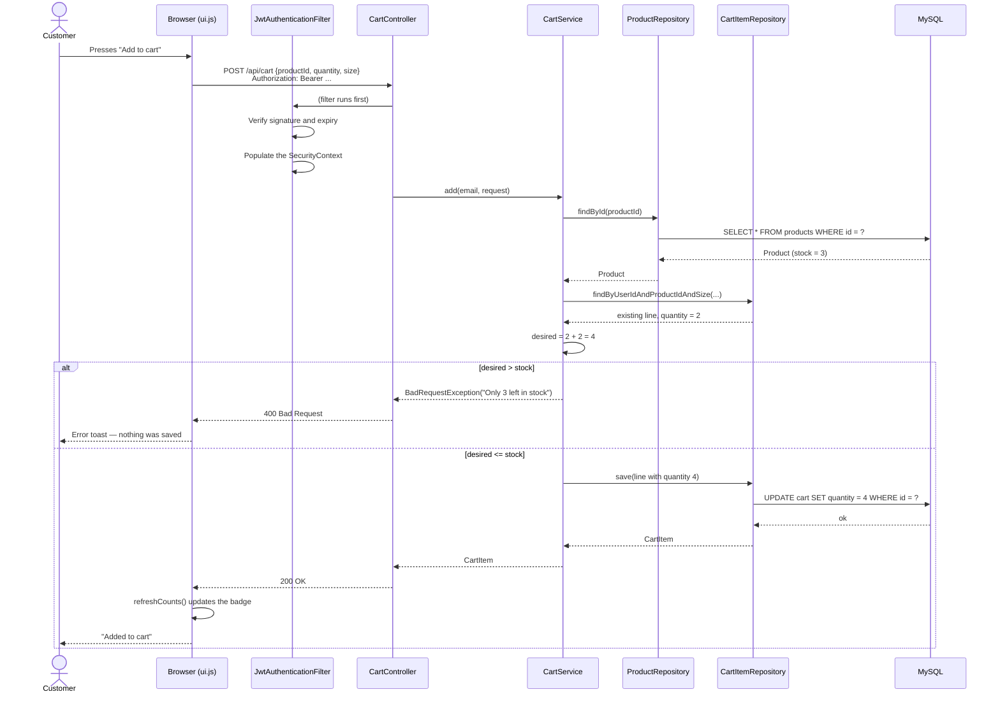
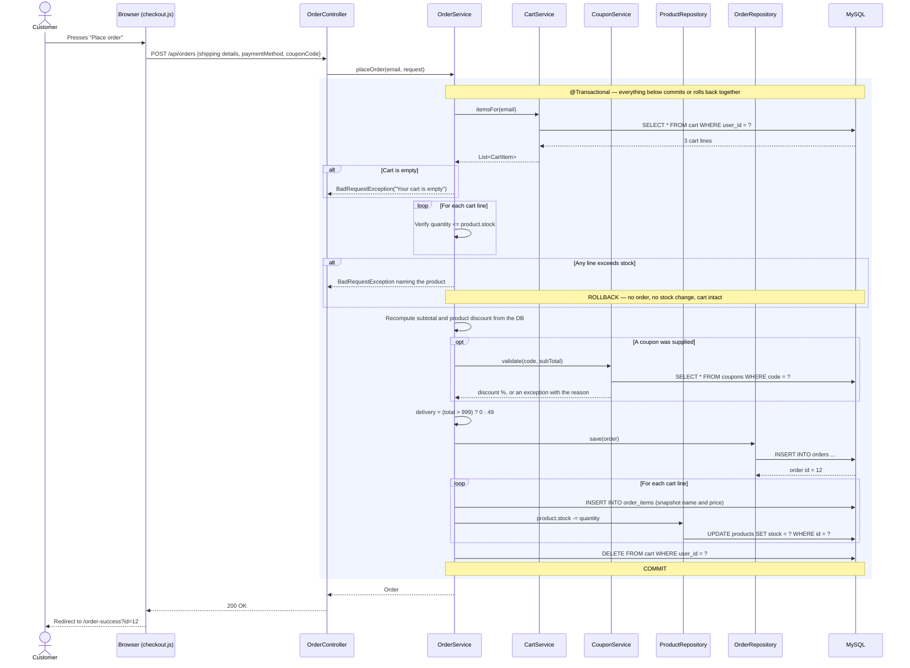
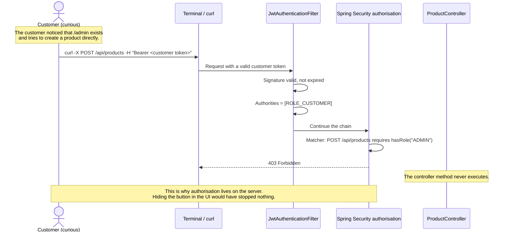

# 13. Sequence Diagrams

## 13.1 Registration

```mermaid
sequenceDiagram
    actor U as Visitor
    participant B as Browser (auth.js)
    participant C as AuthController
    participant S as AuthService
    participant R as UserRepository
    participant E as BCryptPasswordEncoder
    participant J as JwtUtil
    participant DB as MySQL

    U->>B: Fills the registration form
    B->>B: Validate name, email, phone,<br/>password, confirmation
    alt Client-side validation fails
        B-->>U: Field-level errors; nothing is sent
    else Valid
        B->>C: POST /api/auth/register
        C->>C: @Valid — Bean Validation
        C->>S: register(request)
        S->>R: existsByEmail(email)
        R->>DB: SELECT COUNT(*) FROM users WHERE email = ?
        DB-->>R: 0
        R-->>S: false
        S->>S: Check password == confirmPassword
        S->>E: encode(rawPassword)
        E-->>S: $2a$10$... (60-char hash)
        S->>R: save(user with role CUSTOMER)
        R->>DB: INSERT INTO users ...
        DB-->>R: id = 5
        R-->>S: User
        S->>J: generateToken(email, "CUSTOMER")
        J-->>S: eyJhbGciOiJIUzI1NiJ9...
        S-->>C: AuthResponse
        C-->>B: 200 OK
        B->>B: localStorage.setItem("sportx_token", ...)
        B-->>U: "Account created" → dashboard
    end

    Note over S,DB: If the email already exists, the service throws<br/>BadRequestException. GlobalExceptionHandler turns it<br/>into 400 with "An account with this email already exists."<br/>The UNIQUE index on users.email is the second line of defence.
```

## 13.2 Add to cart, with the stock check



## 13.3 Placing an order (the transactional path)



## 13.4 An unauthorised attempt to reach an admin endpoint


