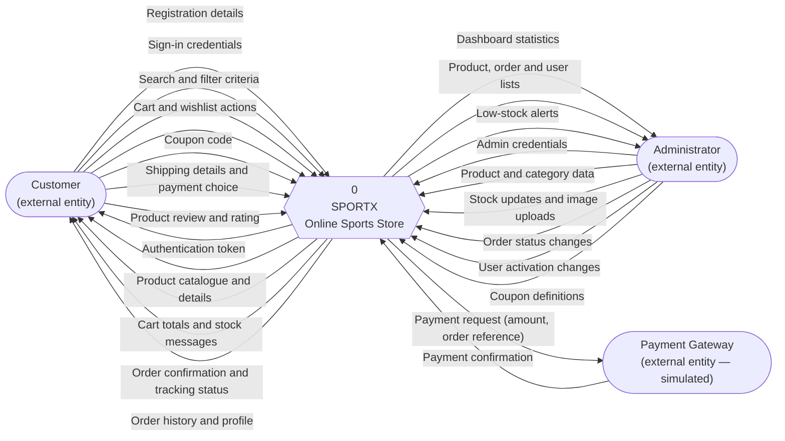

# 14. Data Flow Diagram — Level 0 (Context Diagram)

The context diagram shows the whole system as a single process and names every
flow that crosses its boundary. Nothing inside the system is shown at this
level; that is the point of it.

## Explanation of the flows

| # | From → To | Data |
|---|---|---|
| 1 | Customer → System | Name, email, phone and password at registration; email and password at sign-in |
| 2 | System → Customer | A signed JWT that authorises every later request |
| 3 | Customer → System | Keyword, category, price range, minimum rating, sort order, page number |
| 4 | System → Customer | Paginated product data — image, name, brand, price, discount, rating, stock |
| 5 | Customer → System | Product ID, size and quantity for cart and wishlist changes |
| 6 | System → Customer | Recomputed subtotal, discount, delivery charge and total, or a stock message |
| 7 | Customer → System | Full shipping address and the chosen payment method |
| 8 | System → Payment Gateway | Order reference and amount. **Simulated in this project**: the service marks the order paid without contacting anything external. |
| 9 | Payment Gateway → System | A success acknowledgement |
| 10 | System → Customer | Order ID, itemised summary and current status |
| 11 | Administrator → System | New and edited product and category records, stock values, image files |
| 12 | System → Administrator | Aggregated counts, revenue total, and the full order and user lists |

## Why the boundary is drawn here

The Payment Gateway is drawn as an external entity even though it is simulated,
because that is where the boundary will be when the simulation is replaced with
Razorpay or Stripe. Drawing it inside the system now would mean redrawing the
architecture later. The diagram describes the design, not the current shortcut.

Email delivery for password reset is, for the same reason, a flow that does not
yet exist: the interface is built and validated, but nothing crosses the
boundary, so nothing is drawn. It appears in *Future Scope* instead.
