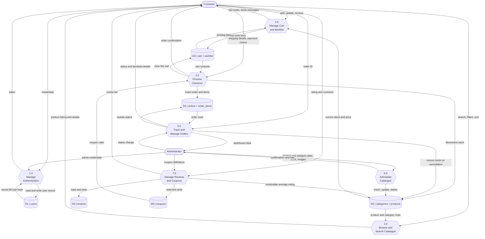

# 15. Data Flow Diagram — Level 1

Level 1 decomposes process 0 into seven sub-processes and shows the six data
stores they read from and write to.

## Process specifications

### 1.0 Manage Authentication
- **Input:** registration details, or email and password
- **Processing:** validate format; check the email is not already registered;
  hash the password with BCrypt; on sign-in compare the supplied password with
  the stored hash and confirm the account is active; issue a signed JWT
- **Output:** a token and a minimal profile
- **Stores:** reads and writes **D1**

### 2.0 Browse and Search Catalogue
- **Input:** keyword, category ID, price bounds, minimum rating, sort key, page
- **Processing:** build a single parameterised JPQL query with nullable
  predicates, apply sorting and paging in SQL
- **Output:** a page of products, or one product with its related items
- **Stores:** reads **D2**

### 3.0 Manage Cart and Wishlist
- **Input:** product ID, quantity, optional size
- **Processing:** look up the product's live stock; merge with any existing
  line for the same product and size; **refuse any change that would exceed
  stock**; compute subtotal, product discount, coupon discount and delivery
- **Output:** the updated line and a full cart summary
- **Stores:** reads **D2**; reads and writes **D3**

### 4.0 Process Checkout
- **Input:** shipping details, payment method, optional coupon code
- **Processing:** inside one transaction — re-verify stock for every line,
  recompute all money from the database, insert the order and its items with
  name and price snapshots, decrement stock, empty the cart
- **Output:** the persisted order
- **Stores:** reads **D3**, **D6**; writes **D2**, **D3**, **D4**

### 5.0 Track and Manage Orders
- **Input:** an order ID from a customer, or a status change from an administrator
- **Processing:** for a customer, return only their own orders; for an
  administrator, return all of them and permit status transitions; on
  cancellation, return each item's quantity to stock
- **Output:** order details, tracking state, dashboard aggregates
- **Stores:** reads and writes **D4**; writes **D2** on cancellation

### 6.0 Administer Catalogue
- **Input:** product and category records, stock values, image files
- **Processing:** validate; store an uploaded image under a server-generated
  UUID filename; refuse to delete a category that still has products
- **Output:** confirmation and refreshed lists
- **Stores:** reads and writes **D2**

### 7.0 Manage Reviews and Coupons
- **Input:** a 1–5 rating with a comment; or a coupon definition
- **Processing:** allow one review per customer per product; recalculate the
  product's average rating and review count; validate coupon code, active flag,
  expiry date and minimum order value
- **Output:** the review list, or the coupon list
- **Stores:** reads and writes **D5** and **D6**; writes the recalculated
  rating to **D2**

## Data store reference

| Store | Tables | Written by | Read by |
|---|---|---|---|
| D1 | `users` | 1.0 | 1.0, 5.0, 6.0 |
| D2 | `categories`, `products` | 4.0, 5.0, 6.0, 7.0 | 2.0, 3.0, 4.0 |
| D3 | `cart`, `wishlist` | 3.0, 4.0 | 3.0, 4.0 |
| D4 | `orders`, `order_items` | 4.0, 5.0 | 5.0 |
| D5 | `reviews` | 7.0 | 2.0, 7.0 |
| D6 | `coupons` | 7.0 | 3.0, 4.0 |
